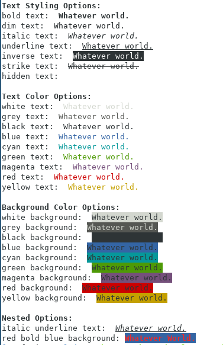

# cli-coloring

> 🦄 A simple text coloring for nodejs logs

## Installation

``` bash
  npm install cli-coloring
  # or
  yarn add cli-coloring
```

## Usage:

### Importing The Package:

```javascript
  const clr = require("cli-coloring")
```

### Text Styling:

available styles: 
  - bold
  - dim
  - italic
  - underline
  - inverse
  - strike
  - hidden

```javascript
  console.log("bold text: ", clr.bold("Whatever world."))
  // or 
  console.log("dim text".dim())
```
### Text Coloring:

available colors: 
  - white
  - grey
  - black
  - blue
  - cyan
  - green
  - magenta
  - red
  - yellow

```javascript
  console.log("white text:", clr.white("Whatever world."))
  // or
  console.log("black text: ", "Whatever world.".black())
```
### Background Coloring:

available bg colors: 
  - bg_white
  - bg_grey
  - bg_black
  - bg_blue
  - bg_cyan
  - bg_green
  - bg_magenta
  - bg_red
  - bg_yellow

```javascript
  console.log("cyan background: ", clr.bg_cyan("Whatever world."))
  // or
  console.log("green background: ", "Whatever world.".bg_green())
```

### Nested options:

```javascript
  console.log("italic underline text: ", clr.italic(clr.underline("Whatever world.")))
  // or
  console.log("red bold blue background:", "Whatever World.".red().bold().bg_blue())
```

## What Should You Get Somthing Like: 


## Contribution

Feel free to raise an [Issue](https://github.com/AM-77/cli-coloring/issues) or submit a [PR](https://github.com/AM-77/cli-coloring/pulls).

## Copyright and license

Code copyright 2020 AM-77. Code released under [MIT license](https://github.com/AM-77/cli-coloring/blob/master/LICENSE).

